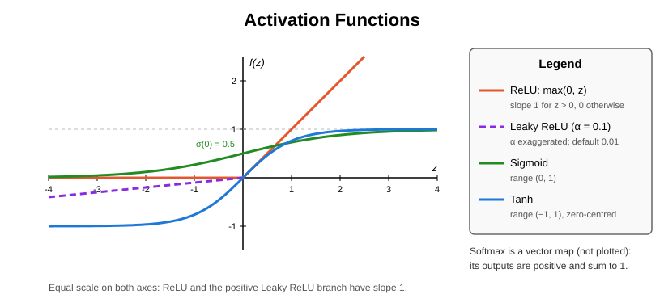
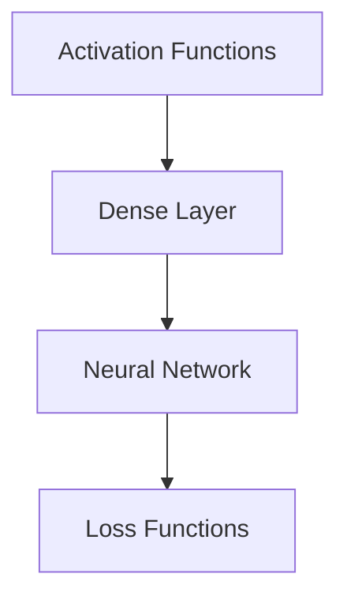

# Activation Functions

## Overview & Motivation

An activation function $f$ is the non-linear transformation applied after the affine map in each neural network layer:

$$a = f(z) = f(W x + b)$$

Without activation functions, stacking layers would collapse into a single affine transformation — the network could only represent linear mappings regardless of depth. Activation functions are what give neural networks their expressive power.

The choice of activation function controls **gradient flow** during back-propagation, **output range**, and **computational cost** — all critical on resource-constrained embedded targets.

## Mathematical Theory

### Forward and Backward

Every activation function provides two operations on a pre-activation vector $z \in \mathbb{R}^k$ with output $a = f(z)$:

| Operation    | Definition                                                          | Purpose                                |
|--------------|---------------------------------------------------------------------|----------------------------------------|
| **Forward**  | $a = f(z)$                                                          | Transform the pre-activation           |
| **Backward** | $\delta = J_f(z)^T g$, with $g = \partial \mathcal{L} / \partial a$ | Propagate the upstream gradient to $z$ |

$J_f(z) = \partial a / \partial z$ is the $k \times k$ Jacobian. For the **element-wise** functions (ReLU, Leaky ReLU, Sigmoid, Tanh), $a_i$ depends only on $z_i$, so the Jacobian is diagonal and the backward pass reduces to a Hadamard product:

$$\delta = g \odot f'(z), \qquad \delta_i = g_i \, f'(z_i)$$

For **Softmax**, every output depends on every input, so the Jacobian is dense; the backward pass is still computed in $O(k)$ as a Jacobian-vector product (see [Softmax](#softmax)). The derivatives of Sigmoid and Tanh are written in terms of the output $a$, so the backward pass reuses the cached forward result instead of re-evaluating the exponential.

### Catalogue

#### ReLU

$$f(z) = \max(0, z), \qquad f'(z) = \begin{cases} 1 & z > 0 \\ 0 & z \le 0 \end{cases}$$

- Computationally cheapest (single comparison).
- Sparse activations accelerate training.
- **Risk:** neurons with $z \le 0$ for all inputs are permanently dead.

#### Leaky ReLU

$$f(z) = \begin{cases} z & z > 0 \\ \alpha z & z \le 0 \end{cases}, \qquad f'(z) = \begin{cases} 1 & z > 0 \\ \alpha & z \le 0 \end{cases}$$

where $\alpha \in [0, 1)$ is a small constant (default $0.01$). Prevents dead neurons by allowing a small gradient for $z < 0$; $\alpha = 0$ reduces to ReLU.

#### Sigmoid

$$f(z) = \frac{1}{1 + e^{-z}}, \qquad f'(z) = f(z)\,\bigl(1 - f(z)\bigr)$$

- Output range $(0, 1)$ with $f(0) = 0.5$ — natural for probabilities.
- Maximum slope $f'(0) = 0.25$.
- **Risk:** saturates for $|z| \gg 0$, causing vanishing gradients.

The naive formula overflows $e^{-z}$ for large negative $z$. The numerically stable evaluation branches on the sign so the exponent is never positive:

$$f(z) = \begin{cases} \dfrac{1}{1 + e^{-z}} & z \ge 0 \\[2ex] \dfrac{e^{z}}{1 + e^{z}} & z < 0 \end{cases}$$

Both branches are the same function; each only evaluates $e^{-|z|} \in (0, 1]$.

#### Tanh

$$f(z) = \tanh(z) = \frac{e^z - e^{-z}}{e^z + e^{-z}}, \qquad f'(z) = 1 - f(z)^2$$

- Output range $(-1, 1)$ — zero-centered, unlike Sigmoid; $f'(0) = 1$.
- Same saturation problem as Sigmoid at extremes.
- $\tanh(z) = 2\sigma(2z) - 1$, so it inherits Sigmoid's saturation behaviour.

#### Softmax

For a vector $z \in \mathbb{R}^k$:

$$a_i = f(z)_i = \frac{e^{z_i}}{\sum_{j=1}^{k} e^{z_j}}$$

- Outputs are strictly positive and form a probability distribution: $\sum_i a_i = 1$.
- **Shift invariant:** $f(z + c\mathbf{1}) = f(z)$ for any scalar $c$. Evaluation subtracts $z_{\max} = \max_j z_j$ first, so every exponent is $\le 0$ and nothing overflows; the outputs are exact probabilities, with no clamping.
- Softmax is only meaningful on the whole vector. Applied to a single element ($k = 1$) it is the constant $1$ with derivative $0$.

**Jacobian.** Differentiating the quotient gives

$$\frac{\partial a_i}{\partial z_j} = a_i\,(\mathbb{1}[i = j] - a_j), \qquad J = \operatorname{diag}(a) - a\,a^T$$

**Backward as a Jacobian-vector product.** $J$ is symmetric, so

$$\delta = J^T g = a \odot g - a\,(a^T g), \qquad \delta_i = a_i \Bigl(g_i - \sum_{k} g_k a_k\Bigr)$$

One dot product $\langle g, a \rangle$ and one element-wise pass: $O(k)$ time and $O(1)$ extra space. The $k \times k$ Jacobian is never formed.

## Complexity Analysis

| Activation | Forward (per vector of $k$)     | Backward (per vector of $k$)                                          | Notes                          |
|------------|---------------------------------|-----------------------------------------------------------------------|--------------------------------|
| ReLU       | $O(k)$ — one comparison each    | $O(k)$ — comparison + multiply                                        | Fastest                        |
| Leaky ReLU | $O(k)$ — comparison + multiply  | $O(k)$                                                                | Negligible overhead vs ReLU    |
| Sigmoid    | $O(k)$ — one $\exp$ each        | $O(k)$ — reuses the output: $a(1 - a)$                                | One transcendental per element |
| Tanh       | $O(k)$ — one $\tanh$ each       | $O(k)$ — reuses the output: $1 - a^2$                                 | One transcendental per element |
| Softmax    | $O(k)$ — max, $k$ exps, one sum | $O(k)$ — Jacobian-vector product $a \odot (g - \langle g, a \rangle)$ | Full Jacobian never formed     |

All activations need $O(1)$ extra space beyond the input, output and gradient vectors the layer already holds.

## Step-by-Step Walkthrough

**Element-wise case.** ReLU on the pre-activations $z = [-0.5, \; 1.2, \; 0.0]$.

**Forward:**

| Neuron | $z$    | $\text{ReLU}(z)$ |
|--------|--------|------------------|
| 1      | $-0.5$ | $0.0$            |
| 2      | $1.2$  | $1.2$            |
| 3      | $0.0$  | $0.0$            |

**Backward** with incoming gradient $g = \partial \mathcal{L} / \partial a = [0.3, \; -0.7, \; 0.1]$:

| Neuron | $f'(z)$           | $\delta = g \odot f'(z)$ |
|--------|-------------------|--------------------------|
| 1      | $0$ (dead)        | $0.3 \times 0 = 0$       |
| 2      | $1$               | $-0.7 \times 1 = -0.7$   |
| 3      | $0$ (at boundary) | $0.1 \times 0 = 0$       |

Neuron 1 is *dead* — its gradient is zero and its weights will not update. If this persists across all training samples, the neuron is permanently inactive.

**Vector case.** Softmax on $z = [1.0, \; 2.0, \; 0.5]$ with upstream gradient $g = [0.3, \; -0.2, \; 0.1]$.

| Step                      | Computation                                   | Result                            |
|---------------------------|-----------------------------------------------|-----------------------------------|
| Shift by $z_{\max} = 2.0$ | $z - z_{\max}$                                | $[-1.0, \; 0.0, \; -1.5]$         |
| Exponentials              | $e^{z - z_{\max}}$                            | $[0.3679, \; 1.0, \; 0.2231]$     |
| Normalise (sum $1.5910$)  | $a = e^{z - z_{\max}} / 1.5910$               | $[0.2312, \; 0.6285, \; 0.1402]$  |
| Dot product               | $\langle g, a \rangle$                        | $-0.0423$                         |
| Backward                  | $\delta_i = a_i (g_i - \langle g, a \rangle)$ | $[0.0792, \; -0.0991, \; 0.0200]$ |

The outputs sum to $1$ and the gradient sums to $0$ ($\sum_i \delta_i = \langle g, a \rangle - \langle g, a \rangle \sum_i a_i = 0$), reflecting the shift invariance.

## Pitfalls & Edge Cases

- **Vanishing gradients with Sigmoid/Tanh.** For deep networks, gradients shrink exponentially through saturated activations. Use ReLU or Leaky ReLU in hidden layers.
- **Dead ReLU neurons.** If a neuron's bias drifts negative enough that no input ever produces $z > 0$, it stops learning. Leaky ReLU or He initialization prevents this.
- **Exponential overflow.** In single precision $e^{z}$ overflows for $z > 88.7$. Sigmoid is evaluated with the sign-branched form and Softmax with the max shift, so neither overflows for any finite input; the saturated outputs round to exactly $0$ or $1$, which makes the derivative $0$ there.
- **Softmax sums.** After the max shift the largest exponential is exactly $1$, so the normaliser is in $[1, k]$ and never underflows to zero. The outputs are not clamped: clamping each probability would break $\sum_i a_i = 1$ and make the backward pass inconsistent with the forward pass.
- **Softmax is not element-wise.** Its scalar form is degenerate (constant $1$, derivative $0$); only the vector form is meaningful. Do not place a Softmax output in front of a loss that already applies softmax to its input (see [Loss Functions](../losses/Loss.md#categorical-cross-entropy)).
- **Non-differentiable points.** ReLU and Leaky ReLU are not differentiable at $z = 0$; the sub-gradient $f'(0) = 0$ (ReLU) and $f'(0) = \alpha$ (Leaky ReLU) is used.
- **Fast-math builds.** Aggressive floating-point optimisation may assume finite values; non-finite inputs (NaN, $\pm\infty$) are outside the contract of every activation.

## Variants & Generalizations

| Variant                      | Key Difference                                          |
|------------------------------|---------------------------------------------------------|
| **Identity (linear)**        | $f(z) = z$, $f' = 1$; raw regression outputs and logits |
| **PReLU (Parametric ReLU)**  | $\alpha$ is a learnable parameter per channel           |
| **ELU (Exponential LU)**     | $\alpha(e^z - 1)$ for $z < 0$; smooth and zero-centered |
| **GELU (Gaussian Error LU)** | $z \cdot \Phi(z)$; used in Transformers                 |
| **Swish / SiLU**             | $z \cdot \sigma(z)$; smooth, non-monotonic              |
| **Hard Sigmoid / Hard Tanh** | Piece-wise linear approximations; no transcendentals    |

## Applications

- **Hidden layers** — ReLU (or Leaky ReLU) is the default choice for feed-forward and convolutional hidden layers.
- **Binary classification output** — Sigmoid maps the output to a probability for binary cross-entropy.
- **Multi-class probabilities** — Softmax produces a probability distribution when probabilities are the desired output (inference, reporting).
- **Recurrent networks** — Tanh is traditionally used in LSTM/GRU gates.
- **Embedded inference** — Hard Sigmoid/Tanh avoid expensive exponentials on MCUs without FPU.

## Connections to Other Algorithms

| Component                                   | Relationship                                                                                                                    |
|---------------------------------------------|---------------------------------------------------------------------------------------------------------------------------------|
| [Dense Layer](../layer/Dense.md)            | Applies the activation after the affine transformation and calls its backward pass                                              |
| [Neural Network](../model/NeuralNetwork.md) | Activations enable the non-linear function approximation that makes deep networks useful                                        |
| [Loss Functions](../losses/Loss.md)         | Sigmoid output feeds binary cross-entropy; categorical cross-entropy takes logits and applies softmax itself — no Softmax layer |

## References & Further Reading

- Nair, V. and Hinton, G.E., "Rectified linear units improve restricted Boltzmann machines", *ICML*, 2010.
- Glorot, X., Bordes, A., and Bengio, Y., "Deep sparse rectifier neural networks", *AISTATS*, 2011.
- Clevert, D.-A., Unterthiner, T., and Hochreiter, S., "Fast and accurate deep network learning by exponential linear units (ELUs)", *ICLR*, 2016.
- Goodfellow, I., Bengio, Y., and Courville, A., *Deep Learning*, MIT Press, 2016.
