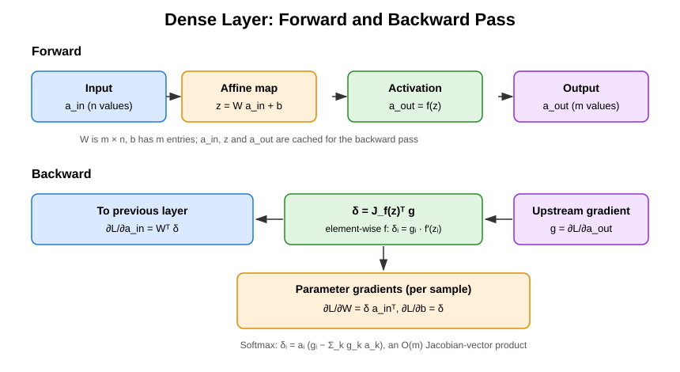
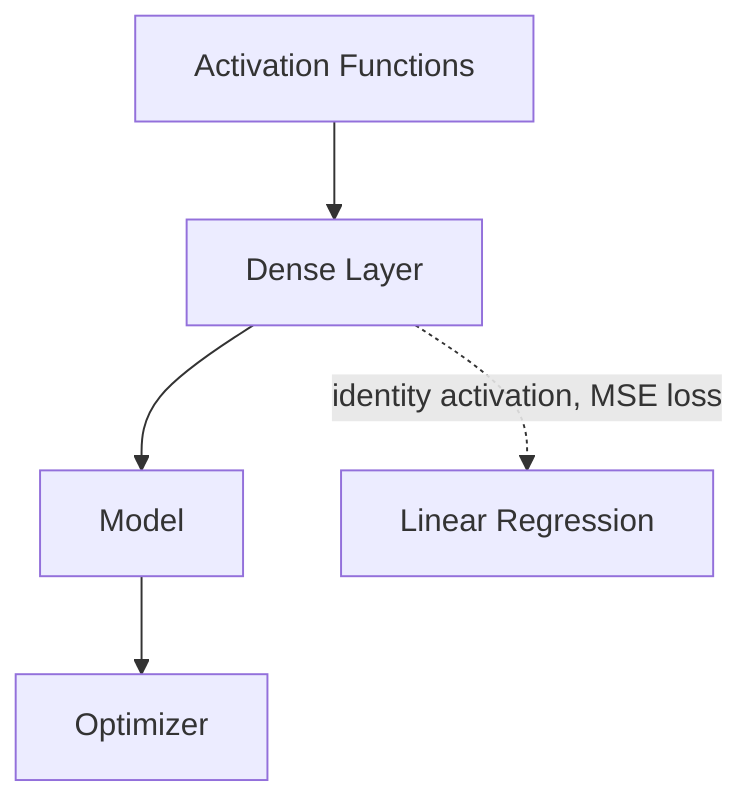

# Dense Layer

## Overview & Motivation

A **dense** (fully-connected) layer is the most fundamental building block of a neural network. It maps an input vector $a_{\text{in}} \in \mathbb{R}^n$ to an output vector $a_{\text{out}} \in \mathbb{R}^m$ through a learnable affine transformation followed by an [activation function](../activation/Activation.md):

$$a_{\text{out}} = f(W \, a_{\text{in}} + b)$$

Every input neuron is connected to every output neuron — hence "fully connected." The layer's **parameters** are the weight matrix $W$ and bias vector $b$; training adjusts these to minimize the loss.

In this library, input size, output size, and parameter count are all **compile-time constants**, enabling static allocation and dimension checking with zero runtime overhead. The caller supplies the initial weights; the biases start at zero.

## Mathematical Theory

### Forward Pass

$$z = W \, a_{\text{in}} + b, \qquad a_{\text{out}} = f(z)$$

where $W \in \mathbb{R}^{m \times n}$, $b \in \mathbb{R}^m$, and $f$ is the activation function. The layer caches $a_{\text{in}}$, $z$ and $a_{\text{out}}$ for the backward pass.

### Backward Pass

Given the upstream gradient $g = \partial \mathcal{L} / \partial a_{\text{out}} \in \mathbb{R}^m$ for one sample:

1. **Pre-activation gradient** — the transposed activation Jacobian applied to $g$:
$$\delta = \frac{\partial \mathcal{L}}{\partial z} = J_f(z)^T g$$
   For an element-wise activation the Jacobian is diagonal and this reduces to $\delta = g \odot f'(z)$. For Softmax it is $\delta_i = a_i \bigl(g_i - \sum_k g_k a_k\bigr)$ with $a = a_{\text{out}}$, still $O(m)$ (see [Softmax](../activation/Activation.md#softmax)).

2. **Weight gradient:**
$$\frac{\partial \mathcal{L}}{\partial W} = \delta \, a_{\text{in}}^T$$

3. **Bias gradient:**
$$\frac{\partial \mathcal{L}}{\partial b} = \delta$$

4. **Input gradient** (propagated to the previous layer):
$$\frac{\partial \mathcal{L}}{\partial a_{\text{in}}} = W^T \delta$$

The backward pass requires a preceding forward pass (it uses the cached $a_{\text{in}}$, $z$, $a_{\text{out}}$). Each call **overwrites** the stored parameter gradients with those of the current sample; they are not accumulated and are not yet exposed to an optimizer (roadmap N8).

### Parameter Vector

The parameters are stored as one flat vector: $W$ in row-major order (row $i$ holds the weights of output neuron $i$) followed by $b$:

$$\theta = [\, W_{1,1}, \ldots, W_{1,n}, \; W_{2,1}, \ldots, W_{m,n}, \; b_1, \ldots, b_m \,], \qquad P = m\,n + m = m(n + 1)$$

For a layer with 128 inputs and 64 outputs: $P = 64 \times 129 = 8{,}256$ parameters.

## Complexity Analysis

| Operation                                                | Time           | Extra space                                                     |
|----------------------------------------------------------|----------------|-----------------------------------------------------------------|
| Forward ($W a + b$, then $f$)                            | $O(m \cdot n)$ | caches $a_{\text{in}}$ ($n$), $z$ ($m$), $a_{\text{out}}$ ($m$) |
| Backward ($\delta$, $\nabla W$, $\nabla b$, $W^T\delta$) | $O(m \cdot n)$ | $O(m)$ temporary $\delta$                                       |

The matrix-vector products dominate both passes. For embedded networks (e.g. $n = 32, m = 16$), a single forward pass takes 512 multiply-accumulate operations.

**Resident memory per layer.** The object holds the parameters ($P$ values), a parameter-gradient buffer of the same size ($P$), and the cached input, pre-activation, output and input-gradient vectors ($2n + 2m$):

$$\text{values} = 2P + 2n + 2m = 2mn + 4m + 2n$$

That is roughly **twice the weight matrix**. A $256 \times 256$ float layer holds $2 \times 65{,}792 + 1{,}024 = 132{,}608$ values, about $518\,\text{KiB}$ — not the $256\,\text{KiB}$ of the weights alone. The model adds a transient $P$-sized copy when parameters are exported or imported.

## Step-by-Step Walkthrough

**Layer:** 3 inputs → 2 outputs, ReLU activation.

$$W = \begin{bmatrix} 0.5 & -0.3 & 0.8 \\ 0.1 & 0.7 & -0.2 \end{bmatrix}, \quad b = \begin{bmatrix} 0.1 \\ -0.1 \end{bmatrix}, \quad a_{\text{in}} = \begin{bmatrix} 1.0 \\ 0.5 \\ -1.0 \end{bmatrix}$$

**Forward:**

| Step                              | Computation                                          | Result              |
|-----------------------------------|------------------------------------------------------|---------------------|
| $z = W a_{\text{in}} + b$         | $[0.5 - 0.15 - 0.8 + 0.1,\; 0.1 + 0.35 + 0.2 - 0.1]$ | $[-0.35,\; 0.55]^T$ |
| $a_{\text{out}} = \text{ReLU}(z)$ | $[\max(0, -0.35),\; \max(0, 0.55)]$                  | $[0.0,\; 0.55]^T$   |

**Backward** with $g = \partial \mathcal{L} / \partial a_{\text{out}} = [0.2,\; -0.4]^T$:

| Step                                   | Computation                                         | Result                                                     |
|----------------------------------------|-----------------------------------------------------|------------------------------------------------------------|
| $\delta = g \odot \text{ReLU}'(z)$     | $[0.2 \cdot 0,\; -0.4 \cdot 1]$                     | $[0,\; -0.4]^T$                                            |
| $\nabla W = \delta \, a_{\text{in}}^T$ | row 1: all zeros; row 2: $-0.4 \times [1, 0.5, -1]$ | $\begin{bmatrix}0 & 0 & 0\\-0.4 & -0.2 & 0.4\end{bmatrix}$ |
| $\nabla b = \delta$                    | —                                                   | $[0,\; -0.4]^T$                                            |
| $\nabla a_{\text{in}} = W^T \delta$    | $-0.4 \times [0.1,\; 0.7,\; -0.2]$                  | $[-0.04,\; -0.28,\; 0.08]^T$                               |

In the flat parameter layout, $\nabla\theta = [0, 0, 0, -0.4, -0.2, 0.4, 0, -0.4]$.

## Pitfalls & Edge Cases

- **Dimension mismatch.** In a multi-layer network, the output size of layer $\ell$ must equal the input size of layer $\ell+1$. This library enforces this at compile time.
- **Weight initialization.** The caller supplies the initial weights. Zero or identical weights make
  all neurons compute the same thing (symmetry problem). For ReLU layers use He initialization,
  $W_{ij} \sim \mathcal{N}(0,\, 2/n_{\text{in}})$ — variance $2/n_{\text{in}}$, standard deviation
  $\sqrt{2/n_{\text{in}}}$, with $n_{\text{in}} = n$ the fan-in. For Sigmoid/Tanh use Glorot,
  $\operatorname{Var}(W_{ij}) = 2/(n_{\text{in}} + n_{\text{out}})$.
- **Backward before forward.** The backward pass uses the caches of the most recent forward pass; calling it first is a precondition violation.
- **Per-sample gradients.** Each backward pass overwrites the parameter gradients. Mini-batch training must sum them across samples itself; accumulation and gradient export are roadmap N8 and N16.
- **Softmax in a hidden or output layer.** Supported through its Jacobian-vector product, but do not feed a Softmax output into categorical cross-entropy, which expects logits (see [Loss Functions](../losses/Loss.md#categorical-cross-entropy)).
- **Large layers exhaust RAM.** The resident footprint is about $2P$ values plus caches (see Complexity Analysis). A $256 \times 256$ float layer needs about 518 KiB; place large layers in statically allocated memory sized for that, not on a small task stack.
- **Accumulation error.** The dot product of $n$ single-precision terms accumulates rounding error of order $n \varepsilon$ in the worst case; keep inputs normalised to similar magnitudes.

## Variants & Generalizations

| Variant                       | Key Difference                                                                                            |
|-------------------------------|-----------------------------------------------------------------------------------------------------------|
| **Convolutional layer**       | Weight sharing across spatial positions; $O(k^2 \cdot c)$ parameters per filter instead of $O(n \cdot m)$ |
| **Recurrent layer**           | Shares weights across time steps; adds a hidden state feedback connection                                 |
| **Batch normalization layer** | Normalizes activations to zero mean and unit variance; accelerates training                               |
| **Dropout layer**             | Randomly zeros activations during training; regularization effect                                         |
| **Sparse layer**              | Only a subset of connections exist; reduces parameter count and computation                               |

## Applications

- **Hidden layers** — One or more dense layers form the core of feed-forward networks for regression and classification.
- **Output layer** — A final dense layer maps to the target dimensionality (1 for regression, $k$ for $k$-class classification).
- **Embedding projection** — Dense layers project high-dimensional sparse inputs to low-dimensional dense representations.
- **Controller networks** — In neural network-based control, small dense layers map state vectors to actuator commands.

## Connections to Other Algorithms

| Component                                           | Relationship                                                                                                                  |
|-----------------------------------------------------|-------------------------------------------------------------------------------------------------------------------------------|
| [Activation Functions](../activation/Activation.md) | Applied after the affine transformation; its Jacobian-vector product gives $\delta$                                           |
| [Model](../model/Model.md)                          | Chains multiple dense layers and concatenates their flat parameter vectors                                                    |
| Optimizer (numerical-toolbox-cpp)                   | Updates the model's flat parameter vector; feeding it the layer's own gradients is roadmap N8/N16                             |
| Linear Regression (numerical-toolbox-cpp)           | A dense layer with an identity activation $f(z) = z$ and MSE loss is linear regression; the identity activation is roadmap N1 |

## References & Further Reading

- Goodfellow, I., Bengio, Y., and Courville, A., *Deep Learning*, MIT Press, 2016.
- He, K., Zhang, X., Ren, S., and Sun, J., "Delving deep into rectifiers: Surpassing human-level performance on ImageNet classification", *ICCV*, 2015.
- Glorot, X. and Bengio, Y., "Understanding the difficulty of training deep feedforward neural networks", *AISTATS*, 2010.
