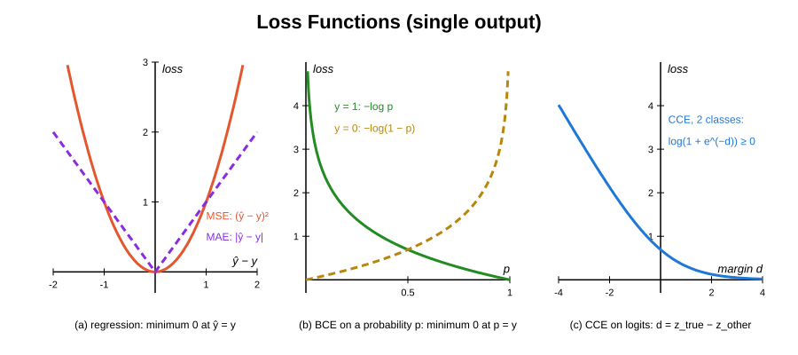
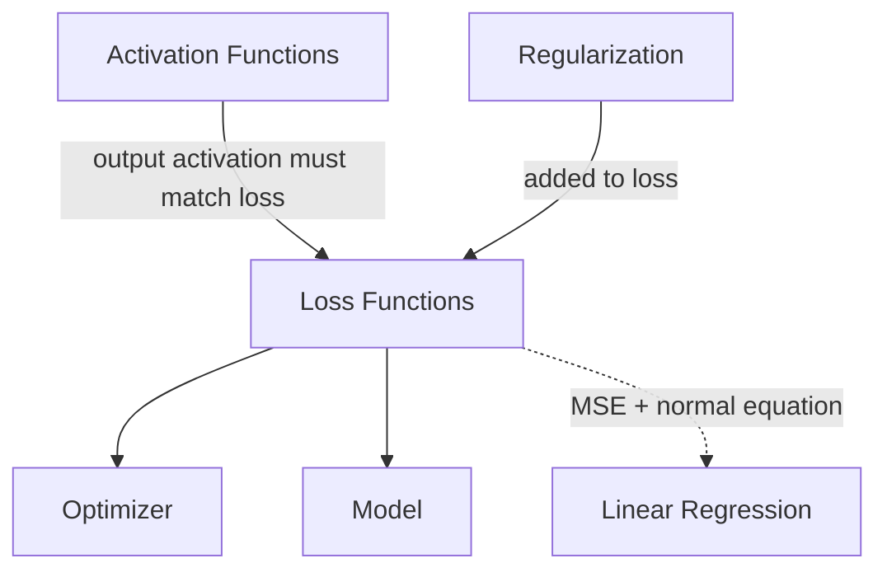

# Loss Functions

## Overview & Motivation

A loss function $\mathcal{L}(\hat{y}, y)$ quantifies how far a model's prediction $\hat{y}$ is from the true target $y$. Training a neural network means finding parameters $\theta$ that minimize the expected loss over the training data:

$$\theta^* = \arg\min_\theta \; \mathbb{E}[\mathcal{L}(f_\theta(x), y)]$$

The loss function defines the **entire learning objective** — different losses lead to different optimal models even on the same data. It must also provide the **gradient** $\nabla_{\hat{y}} \mathcal{L}$ that seeds back-propagation.

In this library every loss is an objective over **one vector argument** $v \in \mathbb{R}^N$ — the $N$ outputs of one sample — compared against a target $y \in \mathbb{R}^N$ fixed when the loss is created. A regularization term $R$ from numerical-toolbox-cpp is added to the same argument:

$$J(v) = \mathcal{L}(v, y) + R(v), \qquad \nabla J(v) = \nabla_v \mathcal{L}(v, y) + \nabla R(v)$$

For MSE, MAE and BCE the argument is the prediction $v = \hat{y}$; for categorical cross-entropy it is the vector of **logits** $v = z$.

## Mathematical Theory

All data terms are **means over the $N$ outputs**, so their gradients carry a $1/N$ factor.

### Mean Squared Error

$$\mathcal{L}_{\text{MSE}} = \frac{1}{N} \sum_{i=1}^{N} (\hat{y}_i - y_i)^2, \qquad \frac{\partial \mathcal{L}}{\partial \hat{y}_i} = \frac{2}{N}(\hat{y}_i - y_i)$$

- Penalizes large errors quadratically → sensitive to outliers.
- Natural choice for **regression** tasks; maximum-likelihood under Gaussian noise.

### Mean Absolute Error

$$\mathcal{L}_{\text{MAE}} = \frac{1}{N} \sum_{i=1}^{N} |\hat{y}_i - y_i|, \qquad \frac{\partial \mathcal{L}}{\partial \hat{y}_i} = \frac{1}{N} \operatorname{sign}(\hat{y}_i - y_i)$$

- Linear penalty → robust to outliers; maximum-likelihood under Laplacian noise.
- Not differentiable at $\hat{y}_i = y_i$; the sub-gradient $\operatorname{sign}(0) = 0$ is used there, so an exact fit is a stationary point.

### Binary Cross-Entropy

The input is a vector of **probabilities** $p = \hat{y} \in [0, 1]^N$ (e.g. a Sigmoid output) and $y_i \in [0, 1]$. Each probability is first clamped to $\tilde{p}_i = \operatorname{clamp}(p_i, \varepsilon, 1 - \varepsilon)$ with $\varepsilon = 10^{-7}$:

$$\mathcal{L}_{\text{BCE}} = -\frac{1}{N}\sum_{i=1}^{N} \left[ y_i \log \tilde{p}_i + (1 - y_i) \log(1 - \tilde{p}_i) \right]$$

$$\frac{\partial \mathcal{L}}{\partial p_i} = \frac{1}{N} \cdot \frac{\tilde{p}_i - y_i}{\tilde{p}_i(1 - \tilde{p}_i)}$$

- The clamp keeps both logarithms finite: each term is at most $-\log \varepsilon \approx 16.1$.
- The gradient is evaluated at the clamped $\tilde{p}$, so it stays finite (at most $1/(\varepsilon(1-\varepsilon)N) \approx 10^7/N$ in magnitude).
- Maximum likelihood estimator for Bernoulli-distributed targets.
- Through a Sigmoid output the chain rule cancels the denominator: $\partial \mathcal{L} / \partial z_i = (p_i - y_i)/N$ away from the clamp.

### Categorical Cross-Entropy

The input is a vector of **logits** $z \in \mathbb{R}^k$ ($N = k$ classes), not probabilities. The loss fuses softmax and cross-entropy:

$$\mathcal{L}_{\text{CCE}} = -\sum_{i=1}^{k} y_i \log \operatorname{softmax}(z)_i = \Bigl(\sum_{i} y_i\Bigr) \operatorname{LSE}(z) - \sum_{i} y_i z_i, \qquad \operatorname{LSE}(z) = \log \sum_{j} e^{z_j}$$

$$\frac{\partial \mathcal{L}}{\partial z_i} = \operatorname{softmax}(z)_i \sum_{j} y_j - y_i$$

- For a one-hot or probability target ($\sum_j y_j = 1$) the gradient is the familiar $\operatorname{softmax}(z) - y$.
- The log-sum-exp is evaluated with the max shift, $\operatorname{LSE}(z) = z_{\max} + \log \sum_j
  e^{z_j - z_{\max}}$, so every exponent is $\le 0$, the sum is in $[1, k]$ and no clamping is
  needed. $z_{\max}$ itself is never added to a small term: the cost is $\log \sum_j e^{z_j -
  z_{\max}} \sum_j y_j - \sum_j y_j (z_j - z_{\max})$ and the softmax is $e^{z_i - z_{\max}} /
  \sum_j e^{z_j - z_{\max}}$. Cost and gradient therefore stay finite and accurate for logits of
  magnitude up to $10^{30}$, including ties at the maximum.
- **Do not pair with a Softmax output layer.** The softmax is inside the loss; the last layer must emit raw logits (identity activation, roadmap N1). A Softmax layer in front would apply softmax twice.
- Unlike the other losses, the data term is a **sum** over classes, the standard convention for cross-entropy of one sample.

## Complexity Analysis

| Loss | Cost   | Gradient | Transcendentals                         |
|------|--------|----------|-----------------------------------------|
| MSE  | $O(N)$ | $O(N)$   | none                                    |
| MAE  | $O(N)$ | $O(N)$   | none (sign)                             |
| BCE  | $O(N)$ | $O(N)$   | $2N$ logarithms (cost only)             |
| CCE  | $O(k)$ | $O(k)$   | $k$ exponentials + 1 logarithm per call |

All losses are linear in the output dimension and use $O(1)$ extra space besides the returned gradient; the regularization term adds its own $O(N)$. The cost is negligible compared to the dense-layer matrix products.

## Step-by-Step Walkthrough

**Categorical cross-entropy on logits.** 3 classes, target $y = [0, 1, 0]$ (class 2), logits $z = [1.0, 2.0, 0.5]$.

| Step                 | Computation                           | Result                                    |
|----------------------|---------------------------------------|-------------------------------------------|
| Max shift            | $z_{\max} = 2.0$, $z - z_{\max}$      | $[-1.0,\; 0.0,\; -1.5]$                   |
| Shifted exponentials | $e^{z - z_{\max}}$                    | $[0.3679,\; 1.0,\; 0.2231]$, sum $1.5910$ |
| Log-sum-exp          | $2.0 + \log 1.5910$                   | $2.4644$                                  |
| Cost                 | $\operatorname{LSE}(z) \cdot 1 - z_2$ | $2.4644 - 2.0 = 0.4644$                   |
| Softmax              | $e^{z_i - \operatorname{LSE}(z)}$     | $[0.2312,\; 0.6285,\; 0.1402]$            |
| Gradient             | $\operatorname{softmax}(z) - y$       | $[0.2312,\; -0.3715,\; 0.1402]$           |

The cost equals $-\log 0.6285$, the negative log-probability of the true class. The gradient pushes the true logit up and the others down, and sums to zero.

**For comparison — MSE on the same probabilities** $\hat{y} = [0.2312, 0.6285, 0.1402]$:

$$\mathcal{L}_{\text{MSE}} = \frac{1}{3}\bigl[0.2312^2 + 0.3715^2 + 0.1402^2\bigr] = 0.0704, \qquad \nabla = \frac{2}{3}(\hat{y} - y) = [0.1541,\; -0.2476,\; 0.0935]$$

**Binary cross-entropy** with $p = [0.9, 0.2]$ and $y = [1, 0]$ ($N = 2$, no clamping active):

$$\mathcal{L}_{\text{BCE}} = -\tfrac{1}{2}\bigl[\log 0.9 + \log 0.8\bigr] = 0.1643, \qquad \nabla = \tfrac{1}{2}\Bigl[\tfrac{0.9 - 1}{0.9 \cdot 0.1},\; \tfrac{0.2 - 0}{0.2 \cdot 0.8}\Bigr] = [-0.5556,\; 0.625]$$

## Pitfalls & Edge Cases

- **$\log(0)$ in BCE.** Probabilities are clamped to $[\varepsilon, 1 - \varepsilon]$ with $\varepsilon = 10^{-7}$. Near the clamp the gradient is large (up to $\approx 10^7/N$); predictions that saturate a Sigmoid at exactly $0$ or $1$ therefore produce very steep but finite updates. A logit-input BCE (fusing Sigmoid and BCE like CCE fuses Softmax) avoids this and is roadmap N9.
- **Softmax + CCE applied twice.** Categorical cross-entropy already applies softmax to its input. Feeding it Softmax probabilities computes the loss of $\operatorname{softmax}(\operatorname{softmax}(z))$ — a different, much flatter objective.
- **Target sum.** The CCE gradient is $\operatorname{softmax}(z)\sum_j y_j - y$. Only when $\sum_j y_j = 1$ does it reduce to $\operatorname{softmax}(z) - y$; unnormalised targets scale the log-sum-exp term accordingly.
- **Mismatched activation and loss.** Sigmoid ↔ BCE (probabilities), identity ↔ CCE (logits), identity ↔ MSE/MAE (regression). Softmax + BCE or Sigmoid + CCE give meaningless gradients.
- **MSE for classification.** MSE can train a classifier but converges slower than cross-entropy because its gradient vanishes as a Sigmoid/Softmax output saturates.
- **Label encoding.** CCE expects one-hot (or probability) targets. Integer labels must be converted first.
- **Regularization acts on the argument.** $R$ is applied to the same vector as the data term (the predictions or logits). Weight decay on the network parameters $\theta$ belongs in the training objective, not in a per-sample loss; that split is roadmap N9/N16.

## Variants & Generalizations

| Variant              | Key Difference                                                             |
|----------------------|----------------------------------------------------------------------------|
| **Huber loss**       | Quadratic for small errors, linear for large; robust regression            |
| **Logit-input BCE**  | Fuses Sigmoid and BCE: $\operatorname{softplus}(z) - yz$; no clamp needed  |
| **Focal loss**       | Down-weights well-classified examples; addresses class imbalance           |
| **KL divergence**    | Measures distance between two distributions; used in variational inference |
| **Hinge loss**       | Margin-based; used in SVMs and some neural classifiers                     |
| **Contrastive loss** | Learns similarity metrics; used in Siamese networks                        |

## Applications

- **Regression** — MSE for Gaussian noise, MAE for Laplacian noise or when outlier robustness is needed.
- **Binary / multi-label classification** — BCE on Sigmoid outputs for independent yes/no decisions (fault detection, anomaly flagging).
- **Multi-class classification** — CCE on logits for mutually exclusive categories (gesture recognition, signal type identification).
- **Probabilistic output** — Cross-entropy losses calibrate prediction confidence, not just accuracy.

## Connections to Other Algorithms

| Component                                           | Relationship                                                                                          |
|-----------------------------------------------------|-------------------------------------------------------------------------------------------------------|
| [Activation Functions](../activation/Activation.md) | Output activation must match: Sigmoid ↔ BCE, identity (logits) ↔ CCE, identity ↔ MSE/MAE              |
| [Model](../model/Model.md)                          | The model's training step minimises an objective of this form over the flat parameter vector $\theta$ |
| Optimizer (numerical-toolbox-cpp)                   | Minimises $J$ using its cost and gradient                                                             |
| Regularization (numerical-toolbox-cpp)              | Adds $R(v)$ and $\nabla R(v)$ to the data term                                                        |
| Linear Regression (numerical-toolbox-cpp)           | Solved analytically when the loss is MSE and the model is linear                                      |

## References & Further Reading

- Goodfellow, I., Bengio, Y., and Courville, A., *Deep Learning*, MIT Press, 2016.
- Bishop, C.M., *Pattern Recognition and Machine Learning*, Springer, 2006.
- Lin, T.-Y. et al., "Focal loss for dense object detection", *ICCV*, 2017.
