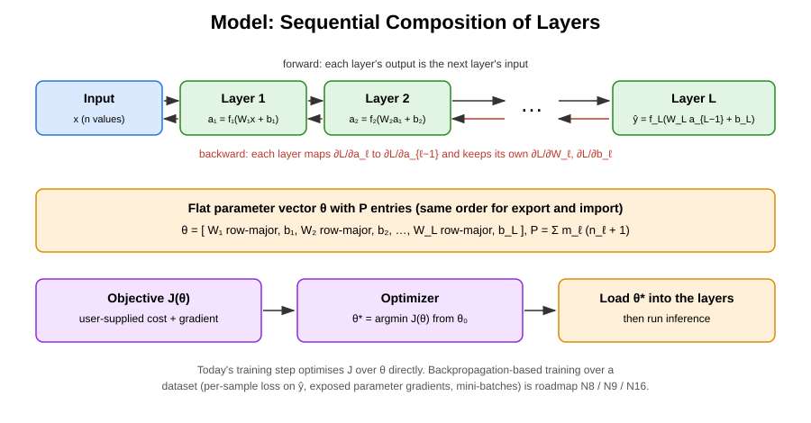
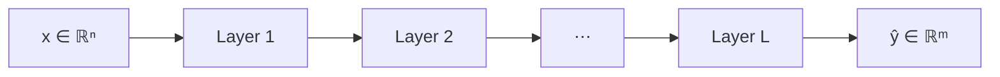
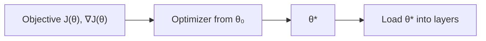
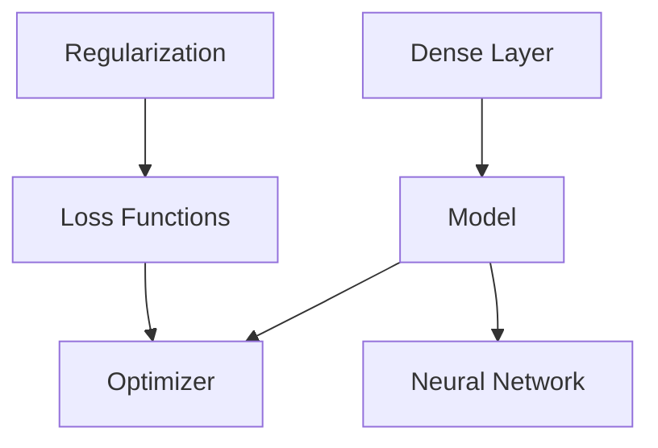

# Model (Sequential Composition)

## Overview & Motivation

A **model** composes a sequence of layers — today [dense layers](../layer/Dense.md) — into a single function $f_\theta: \mathbb{R}^n \to \mathbb{R}^m$. It:

1. Chains layers so the output of each feeds into the next (**forward pass**).
2. Propagates the output gradient backward through the chain (**backward pass**), returning $\partial \mathcal{L} / \partial x$; each layer computes its own parameter gradients on the way.
3. Exports and imports all layer parameters as **one flat vector** $\theta \in \mathbb{R}^P$.
4. Verifies dimensional compatibility **at compile time**: the model input size, every layer-to-layer interface and the model output size must agree, and there must be at least one layer.
5. Offers a **parameter-space training step**: an optimizer minimises a user-supplied objective $J(\theta)$ over the flat parameter vector and the minimiser is loaded into the layers.

The model is fully statically typed — layer dimensions, parameter counts, and memory footprints are all known at compile time, enabling zero-overhead abstraction on embedded targets.

## Mathematical Theory

### Composition

For $L$ layers with transformations $f_1, f_2, \ldots, f_L$:

$$\hat{y} = (f_L \circ f_{L-1} \circ \cdots \circ f_1)(x) = f_L(f_{L-1}(\ldots f_1(x) \ldots))$$

Each $f_\ell$ is a dense layer: $a_\ell = f_\ell(a_{\ell-1}) = \sigma_\ell(W_\ell a_{\ell-1} + b_\ell)$ with $a_0 = x$, $W_\ell \in \mathbb{R}^{m_\ell \times n_\ell}$ and $n_{\ell+1} = m_\ell$.

### Parameter Vector

All weights and biases are concatenated in layer order; each $W_\ell$ is flattened **row-major** (row $i$ = weights of output neuron $i$), followed by its bias:

$$\theta = [\, \operatorname{rows}(W_1),\ b_1,\ \operatorname{rows}(W_2),\ b_2,\ \ldots,\ \operatorname{rows}(W_L),\ b_L \,] \in \mathbb{R}^P, \qquad P = \sum_{\ell=1}^L m_\ell(n_\ell + 1)$$

Export and import use exactly this order, so exporting and re-importing is the identity.

### Forward Pass (Chained Evaluation)

### Backward Pass (Reverse Chain Rule)

Given $g_L = \partial \mathcal{L} / \partial \hat{y}$, the layers are visited in reverse. Layer $\ell$ receives $g_\ell = \partial \mathcal{L} / \partial a_\ell$ and computes

$$\delta_\ell = J_{\sigma_\ell}(z_\ell)^T g_\ell, \qquad \nabla W_\ell = \delta_\ell\, a_{\ell-1}^T, \qquad \nabla b_\ell = \delta_\ell, \qquad g_{\ell-1} = W_\ell^T \delta_\ell$$

so each layer applies **its own** activation derivative before handing $g_{\ell-1}$ to its predecessor. The model returns $g_0 = \partial \mathcal{L} / \partial x$. The per-layer parameter gradients stay inside the layers; exporting them as a flat $\nabla_\theta \mathcal{L}$ is roadmap N8.

### Training Step (Parameter-Space Optimisation)

The training step takes an optimizer, an objective $J: \mathbb{R}^P \to \mathbb{R}$ with its gradient $\nabla J$, and a starting point $\theta_0$:

$$\theta^* = \operatorname{Optimize}(J, \theta_0) \approx \arg\min_\theta J(\theta), \qquad \text{then load } \theta^* \text{ into the layers}$$

It does **not** iterate over a dataset and does not call the forward or backward pass: the objective must itself encode whatever it measures about $\theta$ (for example a user-written empirical risk). If a per-sample [loss](../losses/Loss.md) is passed as $J$, its argument is $\theta$ and its target is a parameter vector — it regresses the parameters onto that target. End-to-end back-propagation training — per-sample loss on $\hat{y}$ (N9), exported parameter gradients (N8) and a mini-batch gradient step (N16) — is on the roadmap.

## Complexity Analysis

| Operation        | Time                | Space                                             |
|------------------|---------------------|---------------------------------------------------|
| Forward pass     | $O(P)$              | per-layer caches $O(\sum_\ell (n_\ell + m_\ell))$ |
| Backward pass    | $O(P)$              | per-layer gradient buffers $O(P)$ (resident)      |
| Parameter export | $O(P)$              | $O(P)$ flat vector returned                       |
| Parameter import | $O(P)$              | $O(\max_\ell P_\ell)$ transient per-layer copy    |
| Training step    | optimizer-dependent | optimizer state + $O(P)$                          |

Forward and backward are linear in the total parameter count $P$ (one multiply-accumulate per weight). The resident model is the sum of its layers — about $2P$ values plus the activation caches for dense layers (see [Dense Layer](../layer/Dense.md#complexity-analysis)).

## Step-by-Step Walkthrough

**Model:** 2 → 3 → 1. Layer 1 uses ReLU, layer 2 uses Sigmoid.

**Compile-time verification chain:**

| Check                                     | Condition     | Status |
|-------------------------------------------|---------------|--------|
| At least one layer                        | $L = 2 \ge 1$ | ✓      |
| Layer 1 input size = model input size     | $2 = 2$       | ✓      |
| Layer 1 output size = layer 2 input size  | $3 = 3$       | ✓      |
| Layer 2 output size = model output size   | $1 = 1$       | ✓      |
| Every layer shares the model's value type | float         | ✓      |

**Parameters** ($P = 3(2 + 1) + 1(3 + 1) = 13$):

$$W_1 = \begin{bmatrix} -0.5 & 0.2 \\ 0.4 & 0.6 \\ 0.1 & 0.2 \end{bmatrix}, \quad b_1 = \begin{bmatrix} 0.1 \\ 0.1 \\ 0.1 \end{bmatrix}, \quad W_2 = \begin{bmatrix} 0.3 & 0.5 & 0.2 \end{bmatrix}, \quad b_2 = [0.03]$$

| Index | Parameter                      | Values                          |
|-------|--------------------------------|---------------------------------|
| 0–5   | $W_1$ row-major ($3 \times 2$) | $-0.5, 0.2, 0.4, 0.6, 0.1, 0.2$ |
| 6–8   | $b_1$                          | $0.1, 0.1, 0.1$                 |
| 9–11  | $W_2$ row-major ($1 \times 3$) | $0.3, 0.5, 0.2$                 |
| 12    | $b_2$                          | $0.03$                          |

**Forward pass** with $x = [1.0, 0.5]^T$:

| Step    | Computation                               | Result                   |
|---------|-------------------------------------------|--------------------------|
| Layer 1 | $z_1 = W_1 x + b_1$                       | $[-0.3,\; 0.8,\; 0.3]^T$ |
|         | $a_1 = \text{ReLU}(z_1)$                  | $[0.0,\; 0.8,\; 0.3]^T$  |
| Layer 2 | $z_2 = W_2 a_1 + b_2 = 0.4 + 0.06 + 0.03$ | $0.49$                   |
|         | $\hat{y} = \sigma(z_2)$                   | $0.6201$                 |

**Backward pass** with loss gradient $g_2 = \partial \mathcal{L} / \partial \hat{y} = [0.12]$:

| Step    | Computation                                                       | Result                                                    |
|---------|-------------------------------------------------------------------|-----------------------------------------------------------|
| Layer 2 | $\delta_2 = g_2 \, \sigma'(z_2) = 0.12 \cdot 0.6201 \cdot 0.3799$ | $0.02827$                                                 |
|         | $\nabla W_2 = \delta_2 a_1^T$, $\nabla b_2 = \delta_2$            | $[0,\; 0.02262,\; 0.00848]$, $0.02827$                    |
|         | $g_1 = W_2^T \delta_2$ (handed to layer 1)                        | $[0.00848,\; 0.01413,\; 0.00565]^T$                       |
| Layer 1 | $\delta_1 = g_1 \odot \text{ReLU}'(z_1)$                          | $[0,\; 0.01413,\; 0.00565]^T$                             |
|         | $\nabla W_1 = \delta_1 x^T$, $\nabla b_1 = \delta_1$              | rows $[0, 0]$, $[0.01413, 0.00707]$, $[0.00565, 0.00283]$ |
|         | $g_0 = W_1^T \delta_1$ (returned by the model)                    | $[0.00622,\; 0.00961]^T$                                  |

Note where $\text{ReLU}'(z_1)$ enters: inside layer 1's own backward pass, not in layer 2's.

## Pitfalls & Edge Cases

- **Dimension mismatch caught at compile time.** If layer $\ell$ outputs $m$ values but layer $\ell+1$ expects $n \ne m$, compilation fails.
- **Empty model.** A model needs at least one layer; zero layers is rejected at compile time.
- **Parameter ordering.** Export and import must use the same concatenation order (layer order, row-major weights, then biases). A transposed flattening silently scrambles a model loaded from an external source.
- **Training step is not back-propagation.** It minimises $J(\theta)$ exactly as supplied. It never sees training samples; if $J$ is a per-sample loss, the "prediction" it compares against the target is the parameter vector itself. Use it only with an objective written over $\theta$, until roadmap N8/N9/N16 add gradient export, a per-sample loss contract and a mini-batch step.
- **Objective size.** The objective's dimension must equal the total parameter count $P$; a mismatch is caught at compile time.
- **Backward before forward.** Each layer's backward pass uses the caches of the last forward pass; the model backward pass must follow a forward pass on the same sample.
- **Memory.** Each dense layer keeps its parameters and a same-sized gradient buffer, so the resident model is about $2P$ values plus activation caches; parameter export adds a transient $P$-sized vector. A model with $P = 10{,}000$ float parameters needs roughly 80 KB resident, not 40 KB — allocate it statically rather than on a small task stack.

## Variants & Generalizations

| Variant                        | Key Difference                                                                     |
|--------------------------------|------------------------------------------------------------------------------------|
| **Sequential model (dynamic)** | Layers stored in a container; dimension checked at runtime instead of compile time |
| **Functional API**             | Supports branching and merging (DAG topology instead of linear chain)              |
| **Residual model**             | Adds skip connections: $a_{\ell+2} = f_{\ell+1}(a_\ell) + a_\ell$                  |
| **Recurrent model**            | Unrolls the same layer across time steps                                           |

## Applications

- **Embedded inference** — Parameters trained offline are imported once and only the forward pass runs at runtime.
- **Gradient-based input sensitivity** — The backward pass yields $\partial \mathcal{L} / \partial x$ for saliency or for inverting a small model.
- **Parameter-space fitting** — Small problems where an objective over $\theta$ can be written directly (e.g. matching a known parameter vector, or a hand-written empirical risk) can use the training step today.
- **System identification and sensor fusion** — Small models (2–3 layers) mapping sensor inputs to plant outputs or state estimates, trained offline today and on-device once roadmap N16 lands.

## Connections to Other Algorithms

| Component                              | Relationship                                                                                   |
|----------------------------------------|------------------------------------------------------------------------------------------------|
| [Dense Layer](../layer/Dense.md)       | The model is a fixed sequence of layers evaluated in order                                     |
| [Neural Network](NeuralNetwork.md)     | Overview of forward propagation, back-propagation and the parameter update the model builds on |
| [Loss Functions](../losses/Loss.md)    | Objectives of the same form; the training step accepts one sized to the parameter vector       |
| Optimizer (numerical-toolbox-cpp)      | Minimises the objective over the flat parameter vector and returns the minimiser               |
| Regularization (numerical-toolbox-cpp) | Added to the objective's argument by the loss                                                  |

## References & Further Reading

- Goodfellow, I., Bengio, Y., and Courville, A., *Deep Learning*, MIT Press, 2016.
- Paszke, A. et al., "PyTorch: An imperative style, high-performance deep learning library", *NeurIPS*, 2019.
- Abadi, M. et al., "TensorFlow: A system for large-scale machine learning", *OSDI*, 2016.
