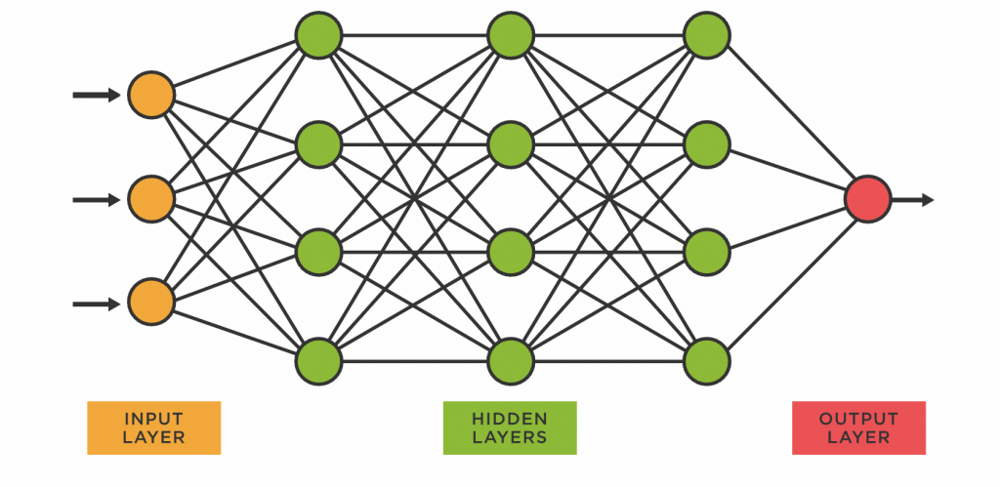
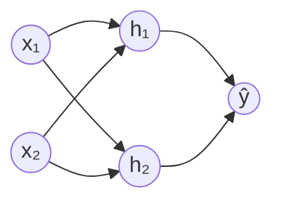
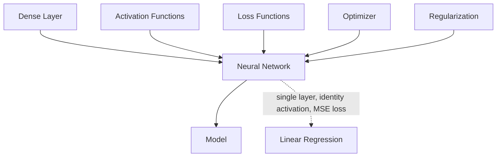

# Neural Networks

## Overview & Motivation

A neural network is a parameterized function $f_\theta: \mathbb{R}^n \to \mathbb{R}^m$ built by composing simple, differentiable transformations called **layers**. Each layer applies an affine map followed by a non-linear activation, and the whole composition is trained by gradient-based optimization.

Neural networks are powerful because of the **universal approximation theorem**: a single hidden layer with enough neurons can approximate any continuous function on a compact set to arbitrary accuracy. In practice, *depth* (many layers) is more parameter-efficient than width for learning hierarchical features.

This library provides a minimal, statically-sized neural network framework designed for **embedded inference** — no heap allocation, no dynamic shapes, full compile-time dimension checking. The forward and backward passes described below are implemented; the parameter update loop that turns them into on-device training is roadmap N8/N9/N16 (see [Model](Model.md)).

## Mathematical Theory

### Forward Propagation

Given $L$ layers, the network computes:

$$a_0 = x$$
$$z_\ell = W_\ell \, a_{\ell-1} + b_\ell, \quad \ell = 1, \ldots, L$$
$$a_\ell = f_\ell(z_\ell)$$
$$\hat{y} = a_L$$

where $W_\ell \in \mathbb{R}^{n_\ell \times n_{\ell-1}}$ are weights, $b_\ell \in \mathbb{R}^{n_\ell}$ are biases, and $f_\ell$ is the activation function for layer $\ell$.

### Loss Function

Training minimizes a scalar loss $\mathcal{L}(\hat{y}, y)$ that measures how far the prediction $\hat{y}$ is from the target $y$. Common choices (see [Loss Functions](../losses/Loss.md)):

| Loss | Formula                                                 | Input             | Use Case                   |
|------|---------------------------------------------------------|-------------------|----------------------------|
| MSE  | $\frac{1}{N}\sum_i(\hat{y}_i - y_i)^2$                  | predictions       | Regression                 |
| BCE  | $-\frac{1}{N}\sum_i[y_i \log p_i + (1-y_i)\log(1-p_i)]$ | probabilities $p$ | Binary classification      |
| CCE  | $-\sum_i y_i \log \operatorname{softmax}(z)_i$          | logits $z$        | Multi-class classification |

### Backpropagation

Backpropagation computes $\nabla_\theta \mathcal{L}$ via the chain rule, working from the output layer backward. With $g_L = \nabla_{a_L} \mathcal{L}$ and $J_{f_\ell}$ the Jacobian of the activation:

$$\delta_\ell = J_{f_\ell}(z_\ell)^T g_\ell, \qquad g_{\ell-1} = W_\ell^T \delta_\ell$$

For element-wise activations $J_{f_\ell}$ is diagonal and $\delta_\ell = g_\ell \odot f_\ell'(z_\ell)$; for Softmax it is the $O(n_\ell)$ product $\delta_\ell = a_\ell \odot (g_\ell - \langle g_\ell, a_\ell \rangle)$ (see [Activation Functions](../activation/Activation.md#softmax)). The gradients with respect to the parameters are:

$$\frac{\partial \mathcal{L}}{\partial W_\ell} = \delta_\ell \, a_{\ell-1}^T, \qquad \frac{\partial \mathcal{L}}{\partial b_\ell} = \delta_\ell$$

### Parameter Update

An optimizer uses the gradients to update the parameter vector $\theta$:

$$\theta_{t+1} = \theta_t - \eta \, \nabla_\theta \mathcal{L}$$

where $\eta$ is the learning rate. More sophisticated optimizers (momentum, Adam) modify this basic rule. With a mini-batch of $B$ samples, $\nabla_\theta \mathcal{L}$ is the average of the per-sample gradients.

## Complexity Analysis

| Phase            | Time                                                      | Space                                          |
|------------------|-----------------------------------------------------------|------------------------------------------------|
| Forward pass     | $O\!\left(\sum_{\ell=1}^L n_\ell \cdot n_{\ell-1}\right)$ | $O\!\left(\sum_\ell n_\ell\right)$ activations |
| Backward pass    | Same as forward                                           | Same + $O(P)$ gradient storage                 |
| Parameter update | $O(P)$                                                    | $O(P)$ optimizer state                         |

where $P = \sum_\ell (n_\ell \cdot n_{\ell-1} + n_\ell)$ is the total parameter count. Both passes cost about one multiply-accumulate per weight, so a network with $P = 10{,}000$ parameters needs on the order of $10^4$ MACs per sample and pass.

## Step-by-Step Walkthrough

**Network:** 2 inputs → 2 hidden (ReLU) → 1 output (Sigmoid), trained with binary cross-entropy on one XOR sample.

**Architecture:**

**Initial parameters:**

$$W_1 = \begin{bmatrix} 0.2 & 0.4 \\ -0.3 & 0.1 \end{bmatrix}, \quad b_1 = \begin{bmatrix} 0.1 \\ 0.2 \end{bmatrix}, \quad W_2 = \begin{bmatrix} 0.5 & -0.4 \end{bmatrix}, \quad b_2 = [0]$$

**Forward pass** with input $x = [1, 0]^T$, target $y = 1$:

| Step                  | Computation                                            | Result          |
|-----------------------|--------------------------------------------------------|-----------------|
| Hidden pre-activation | $z_1 = W_1 x + b_1$                                    | $[0.3, -0.1]^T$ |
| Hidden activation     | $a_1 = \text{ReLU}(z_1)$                               | $[0.3, 0.0]^T$  |
| Output pre-activation | $z_2 = W_2 a_1 + b_2$                                  | $0.15$          |
| Output activation     | $\hat{y} = \sigma(z_2)$                                | $0.5374$        |
| Loss                  | $\mathcal{L} = -(y\log\hat{y} + (1-y)\log(1-\hat{y}))$ | $0.6210$        |

**Backward pass** (Sigmoid followed by BCE simplifies to $\delta_2 = \hat{y} - y$):

| Step            | Computation                                           | Result                   |
|-----------------|-------------------------------------------------------|--------------------------|
| Output gradient | $\delta_2 = \hat{y} - y$                              | $-0.4626$                |
| $\nabla W_2$    | $\delta_2 \, a_1^T$                                   | $[-0.1388, 0]$           |
| $\nabla b_2$    | $\delta_2$                                            | $-0.4626$                |
| Hidden gradient | $\delta_1 = (W_2^T \delta_2) \odot \text{ReLU}'(z_1)$ | $[-0.2313, 0]^T$         |
| $\nabla W_1$    | $\delta_1 \, x^T$                                     | $[[-0.2313, 0], [0, 0]]$ |
| $\nabla b_1$    | $\delta_1$                                            | $[-0.2313, 0]^T$         |

**Update** with $\eta = 0.1$: $W_2 \leftarrow [0.5139, -0.4]$, $b_2 \leftarrow 0.0463$, $W_{1,11} \leftarrow 0.2231$, $b_{1,1} \leftarrow 0.1231$ (all other parameters have zero gradient). Repeating the forward pass gives $\hat{y} = \sigma(0.2242) = 0.5558$ and $\mathcal{L} = 0.5873$ — the loss decreased. Training repeats this step over all four XOR samples.

## Pitfalls & Edge Cases

- **Vanishing gradients.** Deep networks with Sigmoid or Tanh activations suffer exponential gradient decay. Prefer ReLU-family activations in hidden layers.
- **Exploding gradients.** Large weights amplify gradients exponentially. Use proper weight initialization (Glorot for Sigmoid/Tanh, He $\mathcal{N}(0, 2/n_{\text{in}})$ for ReLU) and gradient clipping.
- **Dead neurons.** ReLU neurons that receive only negative inputs output zero forever. Leaky ReLU mitigates this.
- **Symmetric initialization.** Identical initial weights make every neuron in a layer learn the same function; initial weights must break symmetry.
- **Learning rate sensitivity.** Too high → divergence; too low → no progress. Start with $\eta = 0.01$ and adjust.
- **Overfitting.** Small embedded datasets are easily memorized. Apply regularization (L2 weight decay) on $\theta$.
- **Single precision.** All arithmetic is 32-bit float: accumulations over many terms lose precision, and saturated Sigmoid/Softmax outputs round to exactly 0 or 1. Keep inputs normalised and use the numerically stable loss forms.

## Variants & Generalizations

| Variant                                | Key Difference                                                          |
|----------------------------------------|-------------------------------------------------------------------------|
| **Convolutional Neural Network (CNN)** | Layers share weights spatially; efficient for image/signal data         |
| **Recurrent Neural Network (RNN)**     | Layers share weights across time steps; models sequences                |
| **Residual Network (ResNet)**          | Skip connections mitigate vanishing gradients in very deep networks     |
| **Transformer**                        | Attention-based; no recurrence; state-of-the-art for sequences          |
| **Quantized Neural Network**           | Weights and activations in low-bit integers; smaller and faster on MCUs |

## Applications

- **Function approximation** — Learning arbitrary input-output mappings from data.
- **Classification** — Mapping inputs to discrete categories (fault detection, gesture recognition).
- **Regression** — Predicting continuous values (sensor calibration, system identification).
- **Control** — Neural network policies for model-free or model-predictive control on embedded targets.
- **Signal processing** — Learned filters replacing hand-designed FIR/IIR chains.

## Connections to Other Algorithms

| Component                                           | Relationship                                                    |
|-----------------------------------------------------|-----------------------------------------------------------------|
| [Dense Layer](../layer/Dense.md)                    | The fundamental building block; computes affine transformations |
| [Activation Functions](../activation/Activation.md) | Introduce non-linearity after each layer                        |
| [Loss Functions](../losses/Loss.md)                 | Define the training objective                                   |
| Optimizer (numerical-toolbox-cpp)                   | Drives parameter updates via gradient descent                   |
| Regularization (numerical-toolbox-cpp)              | Penalizes complexity to prevent overfitting                     |
| [Model](Model.md)                                   | Composes layers into one network with a flat parameter vector   |
| Linear Regression (numerical-toolbox-cpp)           | Special case: single layer, identity activation, MSE loss       |

## References & Further Reading

- Goodfellow, I., Bengio, Y., and Courville, A., *Deep Learning*, MIT Press, 2016.
- He, K., Zhang, X., Ren, S., and Sun, J., "Delving deep into rectifiers: Surpassing human-level performance on ImageNet classification", *ICCV*, 2015.
- Rumelhart, D.E., Hinton, G.E., and Williams, R.J., "Learning representations by back-propagating errors", *Nature*, 323, 1986.
